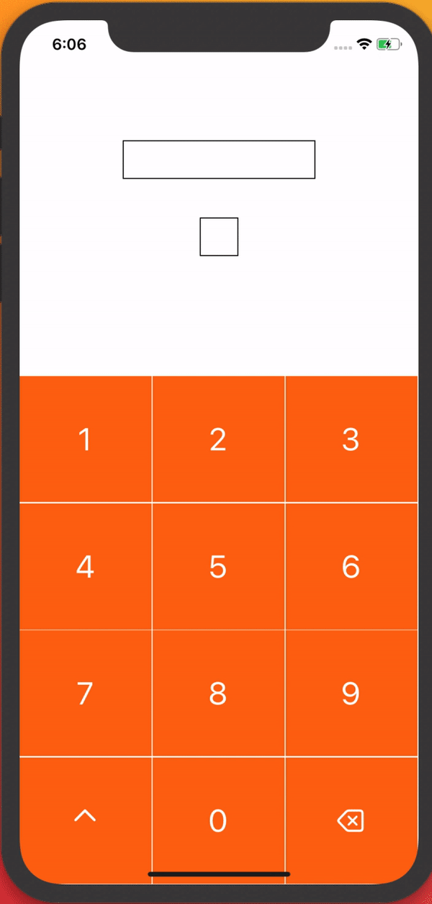
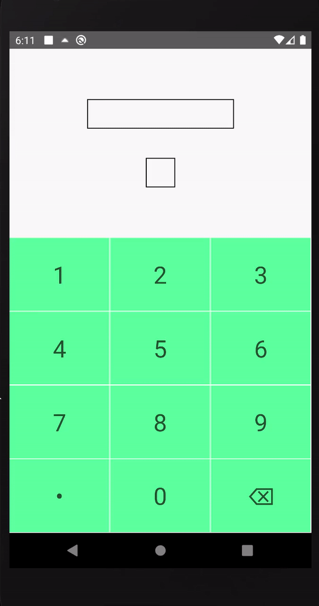

# react-native-display-keyboard
An on-screen keyboard that helps users to insert input characters directly from the display instead from keyboard.


iOS                 |  Android
:------------------:|:-------------------------:
   |  


**Fully customizable on-screen keyboard that lets the keyboard to adapt design as per the app's theme.**

## Installation

```
$ npm install react-native-display-keyboard
```

## Basic Usage

```
import DisplayKeyboard from 'react-native-display-keyboard-feature-display_keyboard_setup';

<DisplayKeyboard
      charCellHeight={100}
      charFontSize={30}
      charCellBackgroundColor={'#8dfcb6'}
      charCellTextColor={'#40634d'}
      borderColor={'white'}
      optnlChar={{key: '\u2022', value: '.'}}
      getInput={this.getInputChar}
      getPressedChar={this.getPressedChar}
    />
```


## Features:
- Customizable keyboard background color
- Customizable keyboard character text - font/color
- Customizable cell border color
- Optional character to display as per the requirement
- Callback to get whole user input
- Callback to get current pressed char

## Task list:
- [x] Number Keypad
- [ ] Alphabet Keyboard

## Contributions
All contributions including new features, requests, bug fixes are open for everyone. Delighted, if someone contributes PR.

## License
[MIT](https://opensource.org/licenses/MIT)


